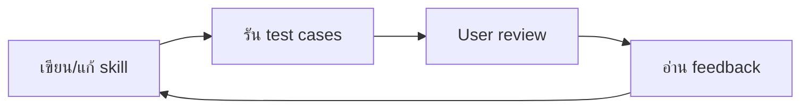

---
tags:
  - skill/workflow
title: 5. Iteration loop
created: 2026-05-13
---

# Step 5 — Iteration Loop

> หัวใจของการสร้าง skill ที่ดี — ทำซ้ำจนพอใจ

## วงจร 1 รอบ

## หลักคิดเวลาปรับ skill

### 1. Generalize จาก feedback

อย่า hard-code วิธีแก้เฉพาะ test case นั้น — มองภาพใหญ่

### 2. ตัดส่วนที่ไม่จำเป็น

ถ้าเนื้อหาส่วนไหนไม่ได้ทำให้ output ดีขึ้น — ตัดทิ้ง

### 3. อธิบาย why

แทนที่จะใช้ ALWAYS/NEVER ตัวใหญ่ — บอกเหตุผลว่าทำไม

### 4. หา repeated work

ถ้าทุก test รัน script คล้าย ๆ กัน → bundle script ใส่ `scripts/`

## เมื่อไหร่ควรหยุด

- ผู้ใช้บอกว่าพอใจแล้ว
- Feedback ว่างเปล่าทุก eval
- ปรับแล้วผลไม่ดีขึ้น

## ไปต่อที่

- [[6. Description optimization]]
- [[Common mistakes]]
