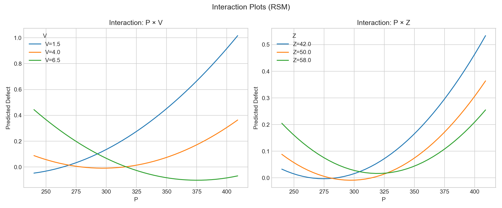
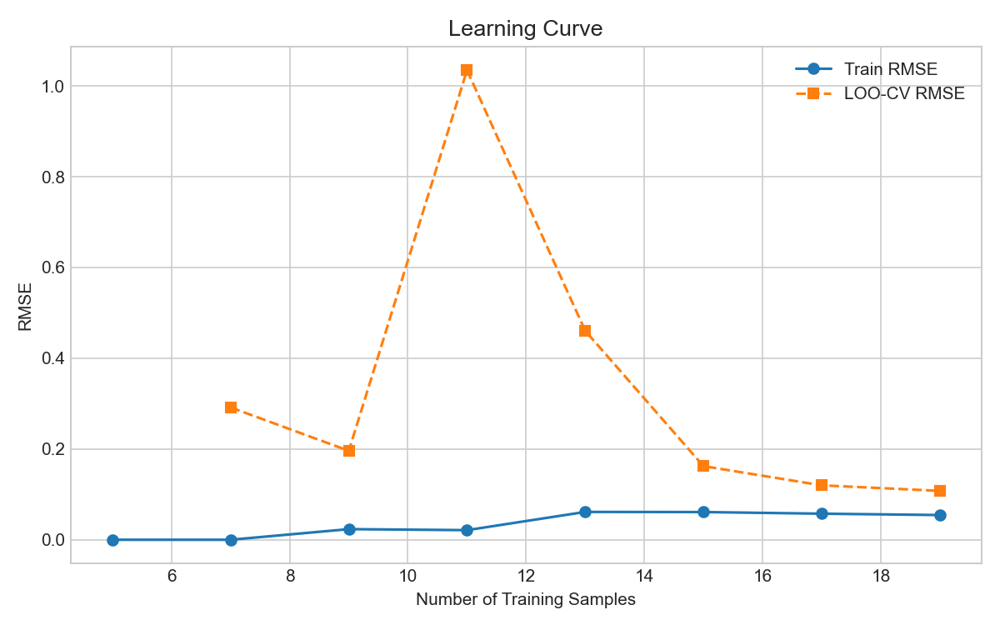
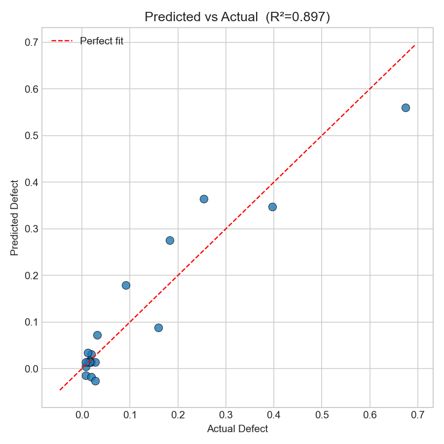
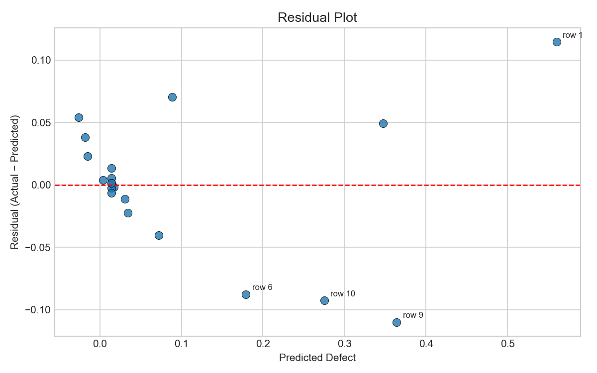
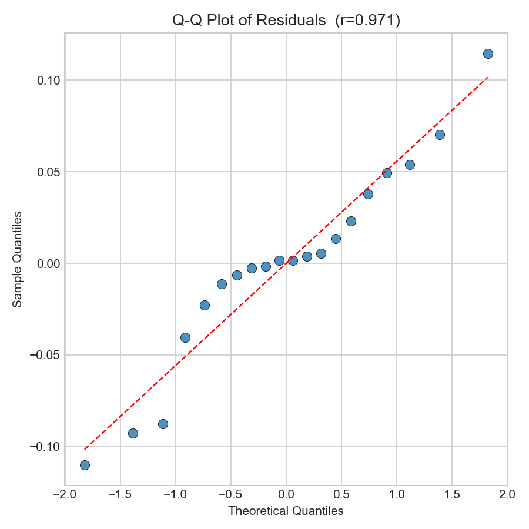

---
tags:
  - ml/report
  - DOE
  - RSM
created: 2026-05-13
dataset: dataset.xlsx
model: Polynomial Regression (RSM, degree=2)
task: regression
plots: effect_plot, interaction_plot, learning_curve, predicted_vs_actual, residual_plot, qq_plot
---

# ML Report — Defect Prediction (DOE/RSM)

## Dataset

| รายละเอียด | ค่า |
|------------|-----|
| จำนวน rows | 20 |
| Features | P, V, Z |
| Target | defect (0–1) |
| Design | Central Composite Design (CCD) |
| Missing values | 0 |

## Model

**Polynomial Regression degree 2 (RSM)** — เลือกเพราะ dataset เป็น CCD (DOE) ขนาดเล็ก ซึ่ง RSM ออกแบบมาเพื่อจุดประสงค์นี้โดยเฉพาะ

> Plot ที่ generate: Effect plot, Interaction plot, Learning curve, Predicted vs Actual, Residual plot, Q-Q plot
> ไม่ generate: Confusion matrix (regression task), Loss curve (ไม่ใช่ neural net), Feature importance (ไม่ใช่ tree model)

## ผลเปรียบเทียบ (LOO Cross-Validation)

| Model | RMSE (LOO-CV) |
|-------|--------------|
| Linear Regression (baseline) | 0.1378 |
| **Polynomial deg2 (RSM)** | **0.1028** |

RSM ดีกว่า baseline **25.4%**

## Performance

| Metric | ค่า |
|--------|-----|
| R² (training) | 0.8974 |
| RMSE (training) | 0.0531 |
| RMSE (LOO-CV) | 0.1028 |
| Target range | 0.0079 – 0.6746 |

> LOO-CV RMSE สูงกว่า Training RMSE — overfitting ปานกลาง คาดได้ใน 20 samples

---

## 1. Effect Plot

**P×V** คือ interaction ที่มีผลมากที่สุด รองลงมาคือ P² — แสดงว่าความสัมพันธ์ระหว่าง P และ V ไม่ใช่ linear และมีผลร่วมกันสูง

## 2. Interaction Plot

- **P×V**: เส้นไม่ขนานกัน → interaction ชัดเจน P สูง + V ต่ำ = defect พุ่งสูง
- **P×Z**: interaction เบากว่า แต่ยังมีอยู่

## 3. Learning Curve

Train RMSE และ LOO-CV RMSE ยังห่างกัน → โมเดล overfit เล็กน้อย เพิ่ม data point จะช่วยได้

## 4. Predicted vs Actual

จุดส่วนใหญ่ใกล้เส้น perfect fit ยกเว้น defect สูง (P=375, V=2.5) ที่โมเดลประมาณต่ำกว่าจริงเล็กน้อย

## 5. Residual Plot

Residuals กระจายรอบ 0 โดยรวม แต่มีบาง row ที่ error สูง — บ่งชี้ว่าโมเดลยังไม่จับ pattern ทั้งหมดในกรณี extreme parameters

## 6. Q-Q Plot

Residuals ใกล้เคียง normal distribution — assumption ของ linear regression ยังคงอยู่

---

## Coefficients (เรียงตามความสำคัญ)

| Term | Coefficient |
|------|-------------|
| P V | -0.8146 |
| P^2 | +0.8033 |
| P Z | -0.4097 |
| V Z | +0.4064 |
| Z^2 | +0.1926 |
| V^2 | +0.1772 |
| V | +0.1080 |
| Z | -0.0897 |
| P | -0.0789 |
| intercept | +0.1000 |

## Actual vs Predicted

| P | V | Z | Actual | Predicted | Error |
|---|---|---|--------|-----------|-------|
| 275 | 2.5 | 45 | 0.0198 | 0.0309 | -0.0111 |
| 375 | 2.5 | 45 | 0.6746 | 0.5600 | +0.1146 |
| 275 | 5.5 | 45 | 0.0119 | 0.0345 | -0.0226 |
| 375 | 5.5 | 45 | 0.0079 | 0.0041 | +0.0038 |
| 275 | 2.5 | 55 | 0.0079 | -0.0151 | +0.0230 |
| 375 | 2.5 | 55 | 0.3968 | 0.3473 | +0.0495 |
| 275 | 5.5 | 55 | 0.0913 | 0.1790 | -0.0877 |
| 375 | 5.5 | 55 | 0.0198 | -0.0181 | +0.0379 |
| 240 | 4.0 | 50 | 0.1587 | 0.0885 | +0.0703 |
| 409 | 4.0 | 50 | 0.2540 | 0.3640 | -0.1100 |
| 325 | 1.5 | 50 | 0.1825 | 0.2752 | -0.0927 |
| 325 | 6.5 | 50 | 0.0278 | -0.0263 | +0.0541 |
| 325 | 4.0 | 42 | 0.0317 | 0.0721 | -0.0403 |
| 325 | 4.0 | 58 | 0.0159 | 0.0175 | -0.0016 |
| 325 | 4.0 | 50 | 0.0119 | 0.0144 | -0.0025 |
| 325 | 4.0 | 50 | 0.0198 | 0.0144 | +0.0055 |
| 325 | 4.0 | 50 | 0.0159 | 0.0144 | +0.0015 |
| 325 | 4.0 | 50 | 0.0278 | 0.0144 | +0.0134 |
| 325 | 4.0 | 50 | 0.0159 | 0.0144 | +0.0015 |
| 325 | 4.0 | 50 | 0.0079 | 0.0144 | -0.0064 |

## Optimal Parameters

| Parameter | ค่า |
|-----------|-----|
| P | 291.7 |
| V | 5.38 |
| Z | 47.1 |
| **Predicted defect** | **0.000002** |

> ข้อควรระวัง: โมเดล predict ค่าติดลบนอก design space — ใช้ `max(0, prediction)` เมื่อนำไปใช้จริง

## สรุป

- RSM Polynomial deg2 เหมาะสมกับ CCD dataset นี้ที่สุด
- R² = 0.90 — อธิบาย variance ได้ ~90%
- ปัจจัยสำคัญที่สุดคือ **interaction P×V** — ควบคุม V ให้สูง (≥5) เมื่อ P สูง เพื่อลด defect
- ถ้าต้องการ generalize มากขึ้น: เพิ่ม data หรือใช้ Ridge Regression เพื่อ regularize
