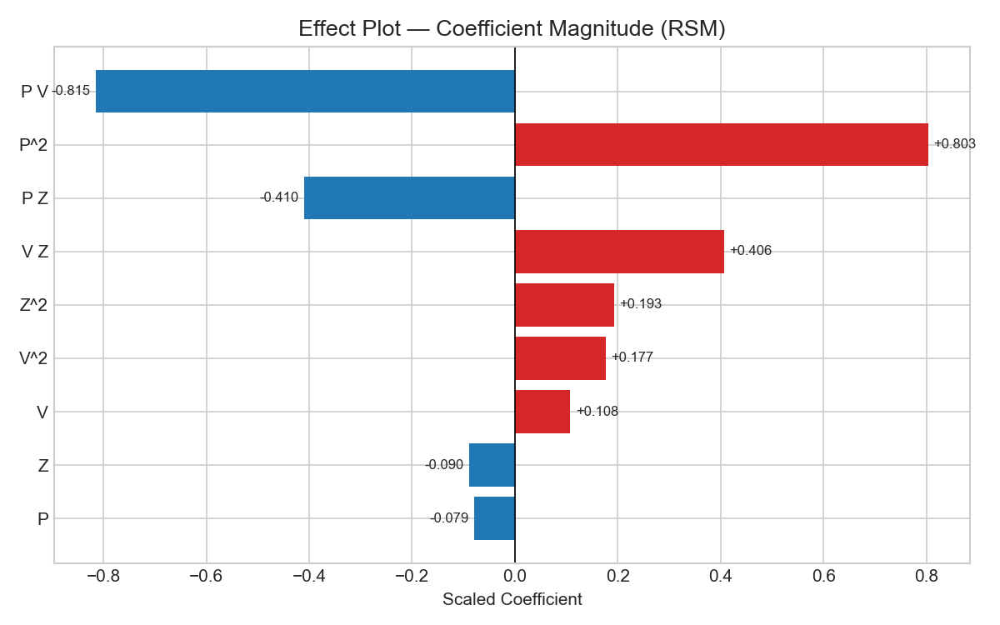

# ML Report Skill

Skill นี้ทำหน้าที่เดียว: **เลือก plot ที่เหมาะสมตามโมเดลที่ใช้ แล้ว generate report พร้อม embed ภาพ**

## หลักการเลือก Plot

ก่อน generate ให้ตรวจสอบ 2 สิ่ง:

1. **Task type** — regression หรือ classification
2. **Model family** — linear, tree-based, neural network, หรือ other

แล้วใช้ตารางด้านล่างเลือก plot ที่เกี่ยวข้อง:

### Plot Matrix

| Plot | Regression | Classification | Linear | Tree | Neural Net | DOE/RSM |
|------|:---:|:---:|:---:|:---:|:---:|:---:|
| Effect / Coefficient plot | ✓ | ✓ | ✓ | — | — | ✓ |
| Feature Importance | ✓ | ✓ | — | ✓ | — | — |
| Interaction plot | — | — | — | — | — | ✓ |
| Main Effect plot | — | — | — | — | — | ✓ |
| Predicted vs Actual scatter | ✓ | — | ✓ | ✓ | ✓ | ✓ |
| Residual plot | ✓ | — | ✓ | ✓ | ✓ | ✓ |
| Q-Q plot (residuals) | ✓ | — | ✓ | ✓ | — | ✓ |
| Learning curve (train vs val) | ✓ | ✓ | ✓ | ✓ | ✓ | ✓ |
| Loss curve (epoch) | — | — | — | — | ✓ | — |
| Confusion matrix | — | ✓ | — | — | — | — |
| ROC / AUC curve | — | ✓ | — | — | — | — |
| Precision-Recall curve | — | ✓ (imbalanced) | — | — | — | — |
| Partial Dependence plot | ✓ | ✓ | — | ✓ | — | — |

> ✓ = เกี่ยวข้อง, — = ไม่เกี่ยวข้อง หรือไม่มีข้อมูล

### วิธีตรวจสอบโมเดล

```python
from sklearn.base import is_classifier, is_regressor
from sklearn.linear_model import LinearRegression, LogisticRegression, Ridge, Lasso
from sklearn.ensemble import RandomForestClassifier, RandomForestRegressor, GradientBoostingRegressor
from sklearn.pipeline import Pipeline
import torch.nn as nn

def detect_model_type(model):
    # ถ้าเป็น Pipeline ให้ดึง step สุดท้าย
    m = model.named_steps['model'] if isinstance(model, Pipeline) else model

    task = 'regression' if is_regressor(m) else 'classification'

    if hasattr(m, 'coef_') or hasattr(m, 'intercept_'):
        family = 'linear'
    elif hasattr(m, 'feature_importances_'):
        family = 'tree'
    elif isinstance(m, nn.Module):
        family = 'neural_net'
    else:
        family = 'other'

    return task, family

def select_plots(task, family, is_doe=False):
    plots = ['predicted_vs_actual', 'residual', 'learning_curve']

    if family == 'linear':
        plots += ['effect_plot', 'qq_plot']
    if family == 'tree':
        plots += ['feature_importance']
    if family == 'neural_net':
        plots += ['loss_curve']
    if task == 'classification':
        plots += ['confusion_matrix', 'roc_curve']
        plots = [p for p in plots if p not in ['predicted_vs_actual', 'residual', 'qq_plot']]
    if is_doe:
        plots += ['interaction_plot', 'main_effect_plot']

    return list(dict.fromkeys(plots))  # deduplicate รักษาลำดับ
```

## ขั้นตอน Generate Report

### 1. ตรวจสอบ input ที่ต้องการ

```python
required_inputs = {
    'model':    'fitted model object (Pipeline หรือ estimator)',
    'X_train':  'DataFrame features ชุด train',
    'y_train':  'Series target ชุด train',
    'X_test':   'DataFrame features ชุด test (ถ้ามี)',
    'y_test':   'Series target ชุด test (ถ้ามี)',
    'output_dir': 'path โฟลเดอร์สำหรับบันทึก assets/',
    'report_path': 'path ไฟล์ .md ที่จะ save report',
}
```

ถ้าไม่มี `X_test` / `y_test` ให้ใช้ LOO-CV หรือ cross-validation แทน

### 2. Generate แต่ละ plot

```python
import matplotlib.pyplot as plt
import matplotlib
matplotlib.use('Agg')  # ไม่แสดง window — save ไฟล์อย่างเดียว

PLOT_STYLE = {
    'figsize': (8, 5),
    'dpi': 150,
    'style': 'seaborn-v0_8-whitegrid',
}
plt.style.use(PLOT_STYLE['style'])
```

#### Effect / Coefficient Plot
```python
def plot_effect(model, feature_names, output_path):
    m = model.named_steps['model'] if isinstance(model, Pipeline) else model
    coefs = m.coef_ if hasattr(m, 'coef_') else m.feature_importances_
    pairs = sorted(zip(feature_names, coefs), key=lambda x: abs(x[1]))
    names, vals = zip(*pairs)

    fig, ax = plt.subplots(figsize=PLOT_STYLE['figsize'])
    colors = ['#d62728' if v > 0 else '#1f77b4' for v in vals]
    ax.barh(names, vals, color=colors)
    ax.axvline(0, color='black', linewidth=0.8)
    ax.set_title('Effect Plot (Sorted by Magnitude)')
    ax.set_xlabel('Coefficient')
    plt.tight_layout()
    fig.savefig(output_path, dpi=PLOT_STYLE['dpi'])
    plt.close()
```

#### Residual Plot
```python
def plot_residual(y_true, y_pred, output_path):
    residuals = y_true - y_pred
    fig, ax = plt.subplots(figsize=PLOT_STYLE['figsize'])
    ax.scatter(y_pred, residuals, alpha=0.7)
    ax.axhline(0, color='red', linestyle='--', linewidth=1)
    ax.set_xlabel('Predicted')
    ax.set_ylabel('Residual')
    ax.set_title('Residual Plot')
    plt.tight_layout()
    fig.savefig(output_path, dpi=PLOT_STYLE['dpi'])
    plt.close()
```

#### Predicted vs Actual
```python
def plot_predicted_vs_actual(y_true, y_pred, output_path):
    fig, ax = plt.subplots(figsize=PLOT_STYLE['figsize'])
    ax.scatter(y_true, y_pred, alpha=0.7)
    lims = [min(y_true.min(), y_pred.min()), max(y_true.max(), y_pred.max())]
    ax.plot(lims, lims, 'r--', linewidth=1, label='Perfect fit')
    ax.set_xlabel('Actual')
    ax.set_ylabel('Predicted')
    ax.set_title('Predicted vs Actual')
    ax.legend()
    plt.tight_layout()
    fig.savefig(output_path, dpi=PLOT_STYLE['dpi'])
    plt.close()
```

#### Learning Curve
```python
from sklearn.model_selection import learning_curve

def plot_learning_curve(model, X, y, output_path):
    sizes, train_scores, val_scores = learning_curve(
        model, X, y, cv=5,
        scoring='neg_root_mean_squared_error',
        train_sizes=np.linspace(0.3, 1.0, 6)
    )
    train_mean = -train_scores.mean(axis=1)
    val_mean = -val_scores.mean(axis=1)

    fig, ax = plt.subplots(figsize=PLOT_STYLE['figsize'])
    ax.plot(sizes, train_mean, 'o-', label='Train RMSE')
    ax.plot(sizes, val_mean, 's--', label='Validation RMSE')
    ax.set_xlabel('Training samples')
    ax.set_ylabel('RMSE')
    ax.set_title('Learning Curve')
    ax.legend()
    plt.tight_layout()
    fig.savefig(output_path, dpi=PLOT_STYLE['dpi'])
    plt.close()
```

#### Interaction Plot (DOE/RSM)
```python
def plot_interaction(model, X, feature_pairs, output_path):
    # วาด interaction ของ 2 features โดย fix features อื่นที่ค่า mean
    fig, axes = plt.subplots(1, len(feature_pairs),
                             figsize=(6 * len(feature_pairs), 5))
    if len(feature_pairs) == 1:
        axes = [axes]

    for ax, (f1, f2) in zip(axes, feature_pairs):
        X_base = X.mean().to_dict()
        f1_vals = np.linspace(X[f1].min(), X[f1].max(), 20)
        for f2_val in [X[f2].min(), X[f2].mean(), X[f2].max()]:
            preds = []
            for v in f1_vals:
                row = {**X_base, f1: v, f2: f2_val}
                preds.append(model.predict(pd.DataFrame([row]))[0])
            ax.plot(f1_vals, preds, label=f'{f2}={f2_val:.1f}')
        ax.set_xlabel(f1)
        ax.set_ylabel('Predicted')
        ax.set_title(f'Interaction: {f1} × {f2}')
        ax.legend(title=f2)

    plt.tight_layout()
    fig.savefig(output_path, dpi=PLOT_STYLE['dpi'])
    plt.close()
```

### 3. สร้าง Markdown Report

ให้ embed ภาพด้วย relative path:

```markdown

```

path ต้องเป็น relative จาก report .md ไปยัง assets/ เพื่อให้ Obsidian แสดงภาพได้

### 4. บันทึกไฟล์

```
report_folder/
├── Report.md          ← markdown พร้อม embed images
└── assets/
    ├── effect_plot.png
    ├── residual_plot.png
    ├── predicted_vs_actual.png
    ├── learning_curve.png
    ├── qq_plot.png
    └── interaction_plot.png   (เฉพาะ DOE)
```

## หลักการสำคัญ

**อย่า generate plot ที่ไม่เกี่ยวข้อง** — confusion matrix สำหรับ classification เท่านั้น, interaction plot สำหรับ DOE/RSM เท่านั้น

**ใช้ `matplotlib.use('Agg')`** ก่อน import pyplot เสมอ เพื่อให้ save ไฟล์ได้โดยไม่ต้อง display window

**Relative path ใน Obsidian** — ใช้ `assets/filename.png` ไม่ใช่ absolute path เพื่อให้ vault ย้ายได้

**ถ้าไม่มี test set** — ระบุใน report ว่า metric มาจาก cross-validation ไม่ใช่ holdout test

## ต่อยอด

- เชื่อมกับ [[machine-learning]] เพื่อ detect model type อัตโนมัติหลัง train
- เชื่อมกับ [[ai-agent-ml]] เพื่อ trigger report generation หลัง agent loop จบ
